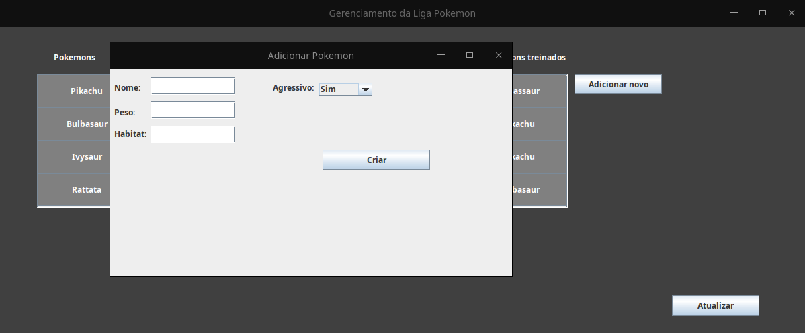
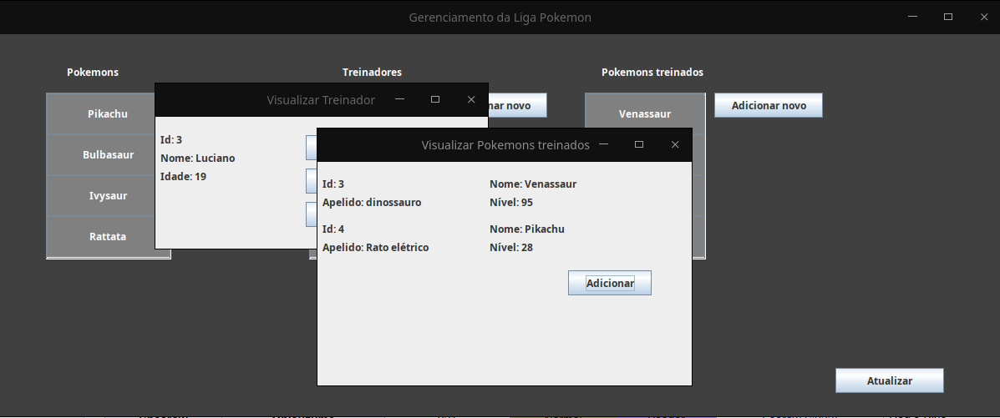

<h1 align="center">
    Trabalho final da disciplina de Orientação a Objetos
</h1>

<h1>
  :clipboard:Requisitos para rodar o projeto:
</h1>
<ul>
<li>Java</li>
<li>Banco de dados Postgresql</li>
<li>Usuário: postgres (alterar no arquivo: DatabaseConnection.java caso queria usar outro usuário)</li>
<li>Senha docker (alterar no arquivo: DatabaseConnection.java caso queira usar outra senha)</li>
<li>Criar um banco com nome: liga_pokemon (alterar no arquivo: DatabaseConnection.java caso tenha criado com outro nome)</li>
</ul>

<h3>Requisitos para avaliação do projeto:</h3>
<ul>
<li> <h4>a) Pelo menos 3 classes de dados com relacionamentos entre elas (sem contar com a classe Principal) <h4>
    <ul>
      <li><a href="src/Entities/Pokemon.java">Classe Pokemon</a></li>
      <li><a href="src/Entities/TrainedPokemon.java">Classe TrainedPokemon que extende de pokemon</a></li>
      <li><a href="src/Entities/Trainer.java">Classe Trainer que se relaciona com TrainedPokemon</a></li>
    </ul>
</li>
<li> 
  <h4>b) Diagrama de classes mostrando as classes, atributos e métodos e seus relacionamentos <h4>
  <ul>
      <li><a href="docs">Diagrama de Classes</a></li>
    </ul>
</li>
<li> 
  <h4>c) Implementação das classes de acordo com o diagrama<h4>
    <ul>
      <li><a href="docs">Vide o diagrama de Classes</a></li>
    </ul>
</li>
<li> 
  <h4>d) Implementação de operações de Inclusão, Exclusão, Alteração, Consulta e Lista<h4>
    <ul>
      <li><a href="exec">Inclusão, Exclusão, Alteração, Consulta e Lista disponíveis para todas as 3 classes de dados, vide imagens e vídeo de demonstração</a></li>
    </ul>
</li>
<li> 
  <h4>e) Uso de arquivos como meio de armazenamento dos dados – permitindo a leitura e gravação de objetos em arquivos (facultado o uso de banco de dados relacional)<h4>
    <ul>
      <li><a href="src/Database">Utilização do banco de dados Postgresql para todas as operaçes do item d) (vide arquivo de conexão e execução do jar seguindo os requisitos para rodar o projeto)</a></li>
    </ul>
</li>
<li> 
  <h4>f) Interface gráfica para interação com o usuário<h4>
    <ul>
      <li><a href="src/GraphicInterface">Interface usando o pacote swing do Java, vide pasta de interfaces(este link) e execução do .jar do projeto</a></li>
    </ul>
</li>
<li> 
  <h4>g) Pelo menos uma classe de teste com 2 métodos de teste usando as anotações do Junit<h4>
    <ul>
      <li><a href="src/tests">Arquivo de teste responsável por testar o cadastro e exclusão de treinadores</a></li>
    </ul>
</li>
<li> 
  <h4>h) Controle e tratamento de Exceções<h4>
    <ul>
      <li><a href="src/">Todos os arquivos que interagem com o banco de dados possuem blocos para tratamento de exceções, além da exceção própria do projeto</a></li>
    </ul>
</li>
<li> 
  <h4>i)  Criação de uma exceção própria da aplicação usando o throw<h4>
    <ul>
      <li><a href="src/Exceptions">Exceção para nomes de Pokemons que contenham números (nome inválido)</a></li>
    </ul>
</li>
<li> 
  <h4>j)  Uso de Listas (ArrayList ou outro tipo de classe de coleções) para manipular os dados lidos e gravados nos arquivos (caso a aplicação faça uso de banco de dados, este uso está implícito)<h4>
    <ul>
      <li><a href="src/">ArrayList<> foi usado para preencher os JScrollPane na tela principal da aplicação com os objetos de cada classe</a></li>
    </ul>
</li>
<li> 
  <h4>k) Usar classe abstrata e/ou interface criada para o trabalho<h4>
    <ul>
      <li><a href="src/Interfaces">Foram usadas 2 interfaces</a></li>
    </ul>
</li>
<li> 
  <h4>l)  JAR da aplicação<h4>
    <ul>
      <li><a href="exec">Jar no diretório exec</a></li>
    </ul>
</li>
</ul>
   <h3>Imagens de algumas telas:</h3>
        
    
    
    
    

